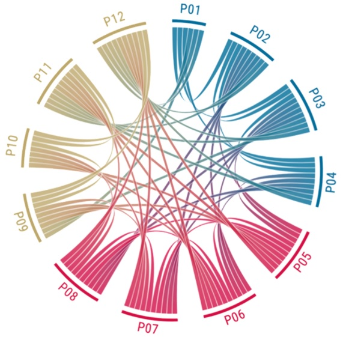

```{r setup, include=FALSE}
knitr::opts_chunk$set(echo = TRUE)
```

# This project is a quick showcase of 3 data analysis and visualization tasks:
1. Visualizing the results of a psychology research project
2. Replicating an interesting plot
3. Analyzing and communicating findings from the RIJKS Museum data set

```{r message=FALSE, warning=FALSE, include=FALSE}
#importing packages
library(tidyr)
library(tidyverse)
library(gridExtra)
library(ggplot2)
```


## Project 1: Visualizing the results of a psychology research project

Goal: visualize the most interesting responses

#### Importing and analyzing data
Importing file after a quick clean-up of duplicate values / grammatical erros in Open Refine
```{r echo=FALSE}
dat <- read.csv("data/cloze-task-results_cleaned.csv")
head(dat)
#str(dat)
```

```{r message=FALSE, warning=FALSE, include=FALSE}
# Additional cleaning
dat <- dat[(dat$response!="" & dat$response!="character(0)"),]
dat <- aggregate(dat$count, by=list(dat$text, dat$response), FUN=sum)
colnames(dat) <- c("text", "response", "count")
```
#### Ideea: Plot the strongest common associations 

### What are the most often encountered associations?

```{r echo=FALSE}
# making it more readable
for(i in 1:length(dat$text)){
  dat$text[i] <- substr(scan(text = dat$text[i], sep = " ",  what="", quiet = TRUE)[4],1,nchar(scan(text = dat$text[i], sep = " ",  what="", quiet = TRUE)[4])-1)
}

dat_max <- dat[dat$count>=31,] 
#don't forget to factorize
dat_max$text <- factor(dat_max$text)
#and order
dat_max <- dat_max[order(dat_max$count, decreasing = TRUE),]
#new dataframe
dat_max

```

```{r echo=FALSE}
dat_max <- dat_max[1:9,]
dat_max$text <- factor(dat_max$text)

p2 <- list()
j2 <- 0
for(i in levels(dat_max$text)){
  j2 <- j2+1
  if(length(dat[dat$text==i,1]) >= 7){
    temp_subset <- dat[dat$text==i,]
    small_subset<-temp_subset[c(1:5),]
    #print(small_subset)
    p2[[j2]] <- ggplot(small_subset[small_subset$text==i,],aes(x= reorder(response,count),count))+geom_bar(stat ="identity")+coord_flip()+ ggtitle(i) +
  theme(plot.title = element_text(hjust = 0.5), axis.title.y=element_blank())
  }else{
    #print("<5")
    small_subset <- dat[dat$text==i,]
    p2[[j2]] <- ggplot(small_subset[small_subset$text==i,],aes(x= reorder(response,count),count))+geom_bar(stat ="identity")+coord_flip()+ ggtitle(i) +
  theme(plot.title = element_text(hjust = 0.5), axis.title.y=element_blank())
  }
  #ggplot(p)
}


#1

do.call(grid.arrange,p2 )
```

## Project 2: Replicating an interesting plot

Goal: replicate the following image:





with the given data:


Quick look at the data
```{r echo=FALSE, message=FALSE, warning=FALSE}
dat <- read.csv2("Data/Chord_test.csv")
dat
```
Based on the format of the data, we need to find a function which takes a correlation matrix as input and plots it as a chord diagram.

We find such a function in the circlize package.
```{r message=FALSE, warning=FALSE, include=FALSE}
library(circlize)

dat[is.na(dat)] <- 0
#chordDiagramFromDataFrame(dat)

dat_r <- data.frame(c(rep("P1",12), rep("P2",12), rep("P3",12), rep("P4",12), rep("P5",12), rep("P6", 12), rep("P7", 12), rep("P8", 12), rep("P9",12), rep("P10", 12), rep("P11", 12), rep("P12",12)), c(rep(c("P1", "P2", "P3", "P4", "P5", "P6", "P7", "P8", "P9", "P10", "P11", "P12"), 12)))

colnames(dat_r) <- c("A", "B")

adj <- c()
for(i in 1:12){
  for(j in 2:13){
    adj <- append(adj, dat[i,j])
  }
}
#adj

dat_r$C <- adj
```

**for nerds:** quick look at the new data frame after formatting
```{r echo=FALSE, message=FALSE, warning=FALSE}
str(dat_r)
```
As you can see, since columns A and B contain 12x12 values, the connections from the beforehand 2D adjacency matrix can be encoded in the 1D column C. This can be then fed into the chordDiagram function of circlize.

### Final chord plot
```{r echo=FALSE, fig.height=6, fig.width=6, message=FALSE, warning=FALSE}
# First color palette (too bright)
customCol <- c(P1 = rgb(51/255,187/255,255/255, 1), 
               P2 = rgb(25/255,178/255,255/255, 1), 
               P3 = rgb(0/255,170/255,255/255, 1),
               P4 = rgb(0/255,153/255,230/255, 1),
               P5 = rgb(255/255,77/255,106/255, 1),
               P6 = rgb(255/255,51/255,85/255, 1),
               P7 = rgb(255/255,25/255,64/255, 1),
               P8 = rgb(255/255,0/255,43/255, 1),
               P9 = rgb(255/255,255/255,153/255, 1),
               P10 = rgb(255/255,255/255,128/255, 1),
               P11 = rgb(255/255,255/255,102/255, 1),
               P12 = rgb(255/255,255/255,77/255, 1)
              )

# Better color palette
customCol2 <- c(P1 = rgb(51/255,187/255,255/255, 1), 
               P2 = rgb(25/255,178/255,255/255, 1), 
               P3 = rgb(0/255,170/255,255/255, 1),
               P4 = rgb(0/255,153/255,230/255, 1),
               P5 = rgb(255/255,77/255,106/255, 1),
               P6 = rgb(255/255,51/255,85/255, 1),
               P7 = rgb(255/255,25/255,64/255, 1),
               P8 = rgb(255/255,0/255,43/255, 1),
               P12 = rgb(230/255,230/255,0/255, 1),
               P11 = rgb(204/255,204/255,0/255, 1),
               P10 = rgb(179/255,179/255,0/255, 1),
               P9 = rgb(153/255,153/255,0/255, 1)
              )
  
circos.clear()
# Graphical parameters
circos.par(cell.padding=c(0,0,0,0), track.margin=c(0,0.05), start.degree = 90, gap.degree =10)
chordDiagram(dat_r, grid.col = customCol2, annotationTrack =  c("name", "grid"),
             transparency = 0.2)
```

## Project 3: Analyzing and communicating findings from the RIJKS Museum data set

GOAL: Visualize the count of different artworks based on their medium over the years
```{r echo=FALSE, message=FALSE, warning=FALSE}
library(tidyverse)
dat <- read.csv("data/rma-downsize.csv")

```

### Dataset

```{r}
head(dat)
```


To be able to do a count of type by year, we will factorize year and aggregate over it
```{r echo=FALSE, message=FALSE, warning=FALSE}
dat_top <-
  dat |> 
  group_by(type) |> 
  summarize( numObjects = n() ) |> 
  arrange(desc(numObjects)) |> 
  slice_head(n=7) |> 
  mutate(EN_type = c("Print", "Photograph", "Drawing", "Sketchbook sheet", "Photomechanical print", "Ex libris", "Stereo photograph"))

dat_subset <-
  dat |> 
  mutate( year = factor(year )) |> 
  filter( type %in% dat_top$type ) |>
  mutate( type = factor(type, levels=dat_top$type, labels = dat_top$EN_type))

dat_top
```
Notice how the top 7 art mediums (8272) represent the significant majority of art objects at the museum (total of 9986). Interesting.

### Ok, now finally the plot(s)


```{r eval=FALSE, include=FALSE}

# ggplot(dat_subset) +
#   geom_line(aes(year, length(type), color = as.factor(type))) +
#   scale_color_discrete(name = "Type")

scale1 <- seq(from=-3000,to=3000,by=1000)
scale_c <- as.character(scale1)

dat_subset %>% 
  mutate(year = as.integer(year)) %>% 

ggplot() + 
  geom_violin(mapping = aes(x = year, y = type, col = type, legend=FALSE, alpha=0.4)) +
  scale_x_discrete(breaks=seq(-3000,2022,by=1000)) +
  labs(title = 'Type frequency distribution over time')

dat_subset %>% 
ggplot() + 
  geom_count(mapping = aes(x = year, y = type, col = type), alpha=0.4) +
  scale_x_discrete(breaks=seq(-3000,2022,by=1000)) +
  labs(title = 'Frequency of different art pieces between year 3000 B.C. and today')
```

```{r echo=FALSE, message=FALSE, warning=FALSE}
dat_top <-
  dat %>%  
  group_by(type) %>% 
  summarize( numObjects = n() ) %>% 
  arrange(desc(numObjects))  %>% 
  slice_head(n=7) %>% 
  mutate(EN_type = c("Print", "Photograph", "Drawing", "Sketchbook sheet", "Photomechanical print", "Ex libris", "Stereo photograph"))

# Absolute plot

left_join(dat, dat_top, by="type") %>% 
  drop_na() %>% 
  group_by(EN_type, year) %>% 
  summarise(Count = n(), .groups = "drop") %>% 
  
ggplot() +
  geom_smooth(mapping = aes(x= year, y = Count, col = EN_type), se=FALSE) +
  labs(title='Absolute type frequency over time') +
  xlab("Year") + 
  ylab("Count") 

# Relative plot
  
left_join(dat, dat_top, by="type") %>% 
  drop_na() %>% 
  group_by(year, EN_type) %>% 
  summarise(numObjects = n()) %>% 
  mutate(proportion = numObjects / sum(numObjects)) %>% 
  ungroup() %>% 
  
ggplot() +
  geom_smooth(mapping = aes(x= year, y = proportion, col = EN_type), se=FALSE)+
  labs(title='Relative type frequency over time') +
  xlab("Year") + 
  ylab("Proportion")  

```


These two plots give us a better understanding about the art's timeline at the museum. We can observe approximately when the first prints or photographs were developed, how some art forms had a shorter lived life (stereo photograph, photomechanical print) and how the classic drawing maintains its relevance from the start of history up to today.

